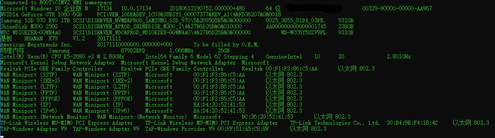

# WMIC

wmic 是一款获取PC电脑相关硬件信息的程序，使用 wmi com c++ 编写。

目前可以获取以下硬件信息：

* 显卡
* 硬盘
* 主板
* 主板 bios 芯片
* 内存条
* CPU处理器
* 网卡

以及以下软件信息：

* 电脑系统

### 使用示例

```c++
#include <print>
#include "WMIC.h"

int main() {
    system("COLOR 0A");
    try {
        WMIC wmic;
        wmic.OperatingSystem();  // 系统
        wmic.VideoController();  // 显卡
        wmic.DiskDrive();        // 硬盘
        wmic.BaseBoard();        // 主板
        wmic.BIOS();             // 主板 BIOS 芯片
        wmic.PhysicalMemory();   // 内存条
        wmic.Processor();        // CPU处理器
        wmic.NetworkAdapter();   // 网卡

        // 以系统序列号为例,生成用户ID
        // 当然也可以任意特征组合形式进行用户ID生成
        auto meta = wmic.OperatingSystem().serialNumber;
        std::println("uid:{}", uid(std::vector<uint8_t>(meta.begin(), meta.end())));

    } catch(const WMICException &e) {
        std::println("{}",e.what());
	}
	return 0;
}
```



### 应用场景

硬件指纹(Hardware fingerprint) - 根据一系列的硬件特征信息生产一个唯一的指纹信息应用于 软件许可限制

获取用户电脑唯一ID

```python
# 例如使用网卡地址生成唯一ID
mac_address = {0x00, 0xf1, 0xf3, 0x86, 0xc5, 0xaa}

id = 0
for v in mac_address:
    id = (id << 8) | v

id = id & 0x1fffffff

print("uid:", id)
# uid: 331712171
```

持久化
通过 UEFI Non-Volatile Random-Access Memory(NVRAM) 进行存储，断电不丢失信息。

读取 uid 和 写入 uid，并写入用户自定义的 meta 信息(软件注册时间，软件到期时间)结构，实现 Software License。

```c++
// UEFI SDRAM 读写
// 注意:此功能需要以管理员权限运行, 否则会失败.

uid_meta_t data = {};

// 读取硬件指纹
std::println("{:s}", wmicUefiRead(uid, &data, sizeof(uid_meta_t)));
std::println("UEFI SDRAM UID:{}", data.uid);

// 存储硬件指纹信息
// 填充数据
data.uid = uid;
std::println("{:s}", wmicUefiWrite(uid, &data, sizeof(uid_meta_t)));
```

### 原理

https://docs.microsoft.com/en-us/windows/win32/wmisdk/wmi-start-page

### 编译

仅支持 windows 版本，使用 C++23 or 更高即可编译。

### 其他工具

window系统可以使用系统自带的工具（ComputerHardwareIds.exe）获取 硬件id

