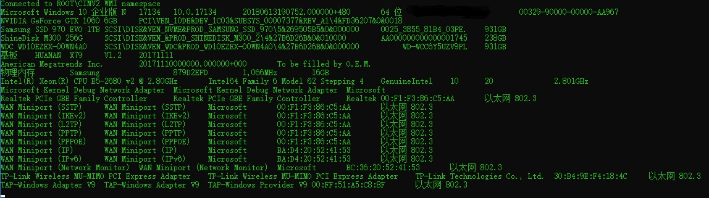

#WMIC

wmic 是一款获取PC电脑相关硬件信息的程序，使用 wmi com c++ 编写。

目前可以获取以下硬件信息：
* 显卡
* 硬盘
* 主板
* 主板 bios 芯片
* 内存条
* CPU处理器
* 网卡

以及以下软件信息：
* 电脑系统

### 使用示例
```c++
#include <iostream>
#include "WMIC.h"

int main()
{
    system("COLOR 0A");
	try
	{
		WMIC wmic;
		wmic.OperatingSystem();//系统
		wmic.VideoController();//显卡
		wmic.DiskDrive();//硬盘
		wmic.BaseBoard();//主板
		wmic.BIOS();//主板 BIOS 芯片
		wmic.PhysicalMemory();//内存条
		wmic.Processor();//CPU处理器
		wmic.NetworkAdapter();//网卡
	}
	catch (const WMICException& e)
	{
		std::cout << e.what() << std::endl;
	}
	return 0;
}
```


### 应用场景
硬件指纹 - 根据一系列的硬件特征信息生产一个唯一的指纹信息应用于 软件许可限制

### 原理
https://docs.microsoft.com/en-us/windows/win32/wmisdk/wmi-start-page

### 编译
仅支持 windows 版本，使用 C++14 or 更高即可编译。

### 其他工具
window系统可以使用系统自带的工具（ComputerHardwareIds.exe）获取 硬件id

